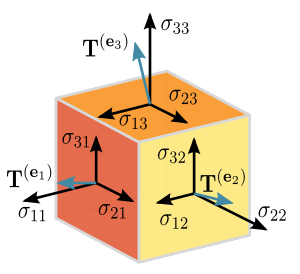

# TensorMine
**Models Implemented in TensorFlow 2.0** (*Under active development.*)

The core open source library to help you develop and train ML models easy and fast as never before.



# Why TensorFlow ?
TensorFlow is an end-to-end open source platform for machine learning. It has a comprehensive, flexible ecosystem of tools, libraries and community resources that lets researchers push the state-of-the-art in ML and developers easily build and deploy ML powered applications.

**Easy model building**
Build and train ML models easily using intuitive high-level APIs like Keras with eager execution, which makes for immediate model iteration and easy debugging.

**Robust ML production anywhere**
Easily train and deploy models in the cloud, on-prem, in the browser, or on-device no matter what language you use.

**Powerful experimentation for research**
A simple and flexible architecture to take new ideas from concept to code, to state-of-the-art models, and to publication faster.

[Install TensorFlow and Get Started!](https://www.tensorflow.org/install)

## How To Code ?

**Approach 1: Sequential/Functional Interface**

The best place to start is with the user-friendly Sequential API. You can create models by plugging together building blocks. Run the “Hello World” example below, then visit the tutorials to learn more.

```
my_model = tf.keras.models.Sequential([
    tf.keras.layers.Flatten(input_shape=(28, 28)),
    tf.keras.layers.Dense(128, activation='relu'),
    tf.keras.layers.Dropout(0.2),
    tf.keras.layers.Dense(10, activation='softmax')
])

OR

inputs = tf.keras.layers.Input(shape=(784,))
x = tf.keras.layers.Dense(64, activation='relu')(inputs)
x = tf.keras.layers.Dense(64, activation='relu')(x)
predictions = Dense(10, activation='softmax')(x)
my_model = tf.keras.models.Model(inputs=inputs, outputs=predictions)
```


**Approach 2: Subclassing Interface**

The Subclassing API provides a define-by-run interface for advanced research. Create a class for your model, then write the forward pass imperatively. Easily **author custom layers**, **activations**, **training loop** and much more.

```
class MyModel(tf.keras.Model):
    def __init__(self):
        super(MyModel, self).__init__()
        self.conv1 = Conv2D(32, 3, activation='relu')
        self.flatten = Flatten()
        self.d1 = Dense(128, activation='relu')
        self.d2 = Dense(10, activation='softmax')

    def call(self, x):
        x = self.conv1(x)
        x = self.flatten(x)
        x = self.d1(x)
        return self.d2(x)

# Call your model
model = MyModel()
```

*We prefer Subclassing to implement all the models since it gives more control for advanced research.*

## Whats cooking ?

+ Text Classification
+ Sentiment Analysis
    * Aspect Based Sentiment Analysis
+ Named Entity Recognition
+ Neural Machine Translation
+ Custom Layers & Blocks
    * Self-Attention
    * Transformer Encoder - Decoder
    * Evolved-Transformer

*And a lot more on the way.*

**[Build, deploy, and experiment easily with TensorFlow](https://www.tensorflow.org/)**